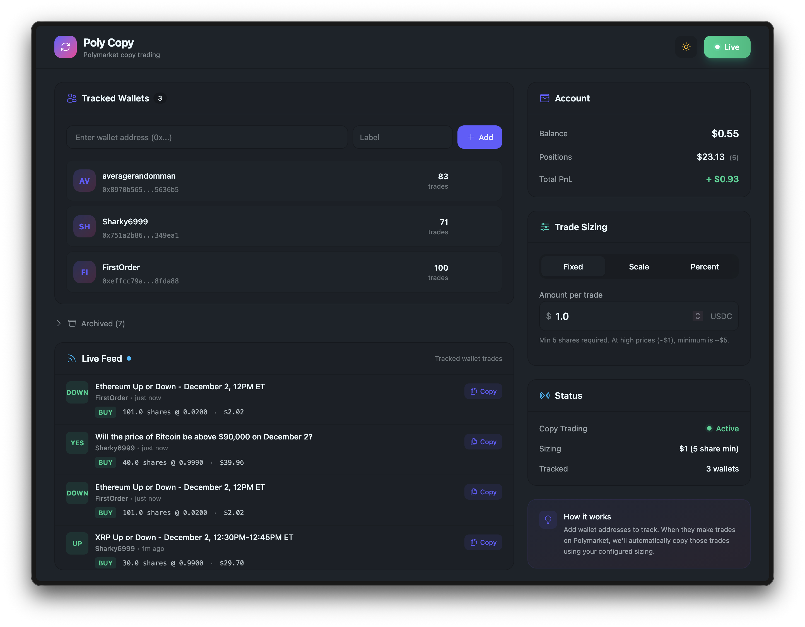

# == Poly Copy ==



## Demo

## FAQ 

<details>
  <summary>1. Where data is being stored? </summary>
  
  Everything runs and stays on your machine, `.db` file holds your credentials and keys next to the binary.
</details>

<details>
  <summary>2. How to start? </summary>
  
  Get binary from releases for your OS or run in dev mode via elixir. 
</details>

<details>
  <summary>3. Is it safe? </summary>
  
  It's open source, your own risk. But yes, runs ok, no issues while I was running it.
</details>

<details>
  <summary>4. Is it free? </summary>
  
  It's open source, yes. But donations are welcome. 
</details>

## Development

```zsh
mix setup

mix phx.server
```